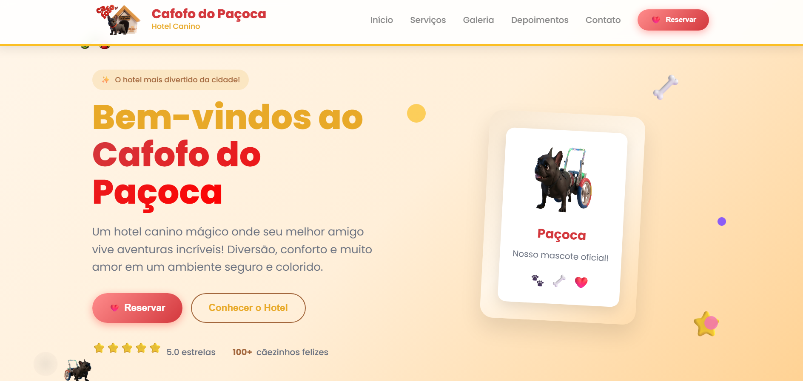

# 🐶 Cafofo do Paçoca - Hotel Canino

<p align="center">
  
</p>

<p align="center">
  
  
</p>

## � Sobre o Projeto

Bem-vindo ao **Cafofo do Paçoca**, um hotel canino mágico onde seu melhor amigo vive aventuras incríveis! Este é um website completo e responsivo desenvolvido para apresentar os serviços de hospedagem, cuidados e bem-estar para pets.

### 🎯 Objetivo

Criar uma presença digital profissional e acolhedora para hotéis caninos, pet shops e serviços especializados em cuidados premium para cães, transmitindo confiança, profissionalismo e amor pelos animais.

## 🚀 Funcionalidades

- ✅ **Design Responsivo**: Perfeito em todos os dispositivos
- ✅ **Animações CSS**: Efeitos visuais suaves e profissionais
- ✅ **Integração WhatsApp**: Reservas diretas via WhatsApp
- ✅ **Galeria de Fotos**: Showcase do espaço e serviços
- ✅ **Depoimentos**: Seção de avaliações de clientes
- ✅ **Formulário de Contato**: Interface intuitiva para contato
- ✅ **SEO Otimizado**: Preparado para mecanismos de busca

## 🛠️ Tecnologias Utilizadas


## � Demonstração

🌐 **[Ver Site Online](https://franciscomarquesdev.github.io/cafofodopa-oca/)**

## 🎨 Seções do Site

1. **Hero Section**: Apresentação principal com call-to-action
2. **Serviços**: Cards com os serviços oferecidos
3. **Galeria**: Fotos do espaço e instalações
4. **Depoimentos**: Avaliações de clientes satisfeitos
5. **Contato**: Informações e formulário de contato
6. **Footer**: Links e informações adicionais

## 📋 Como Usar

### 1. Clone o Repositório

```bash
git clone https://github.com/FranciscoMarquesdev/cafofodopa-oca.git
cd cafofodopa-oca
```

### 2. Personalize o Conteúdo

- Edite `index.html` para alterar textos e informações
- Modifique `styles.css` para ajustar cores e estilos
- Substitua imagens na pasta `img/` pelas suas próprias

### 3. Configure o WhatsApp

- Substitua o número `5585986327003` pelo seu número
- Personalize as mensagens automáticas

### 4. Hospedagem

O site é estático e pode ser hospedado em:

- GitHub Pages
- Netlify
- Vercel
- Qualquer servidor web

## 🔧 Personalização

### Cores Principais

```css
:root {
  --primary-color: #e8a928;
  --secondary-color: #d3383d;
  --accent-color: #fbbf24;
}
```

## 👨‍💻 Desenvolvedor

**Francisco Marques**

- Estudante de Análise e Desenvolvimento de Sistemas
- Especialista em desenvolvimento web front-end
- GitHub: [@FranciscoMarquesdev](https://github.com/FranciscoMarquesdev)

## 📄 Licença

Este projeto está sob a licença MIT. Veja o arquivo [LICENSE](LICENSE) para mais detalhes.

## 🤝 Como Contribuir

1. Faça um fork do projeto
2. Crie uma branch para sua feature (`git checkout -b feature/MinhaFeature`)
3. Commit suas mudanças (`git commit -m 'Adiciona nova feature'`)
4. Push para a branch (`git push origin feature/MinhaFeature`)
5. Abra um Pull Request

## 📈 Comandos Git Básicos

```bash
# Adicionar alterações
git add .

# Criar commit
git commit -m "Descrição das alterações"

# Enviar para o repositório
git push origin main
```

---

<p align="center">
  Feito com ❤️ por Francisco Marques
</p>
